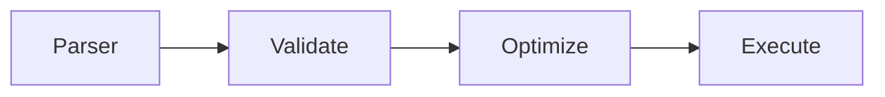

## Apache Calcite
### 简介
> Apache Calcite是一款开源的动态数据管理框架，它提供了标准的 SQL 语言、多种查询优化和连接各种数据源的能力，但不包括数据存储、处理数据的算法和存储元数据的存储库。
### 架构

### Calcite 执行流程

* 解析SQL，目的是为了将 SQL 转换成 AST 抽象语法数，Calcite 有一个专门的对象 SqlNode 表示；
* 语法检查，用数据库的元数据信息进行语法验证；
* 逻辑优化，根据前面生成的逻辑计划按照相应的规则（Rule）进行优化；
* SQL执行，按照执行计划执行；

### 参考文档
* [Apache Calcite 框架 50 倍性能优化实践](https://developer.aliyun.com/article/919361)
* [Apache Calcite 论文](https://arxiv.org/pdf/1802.10233.pdf)
