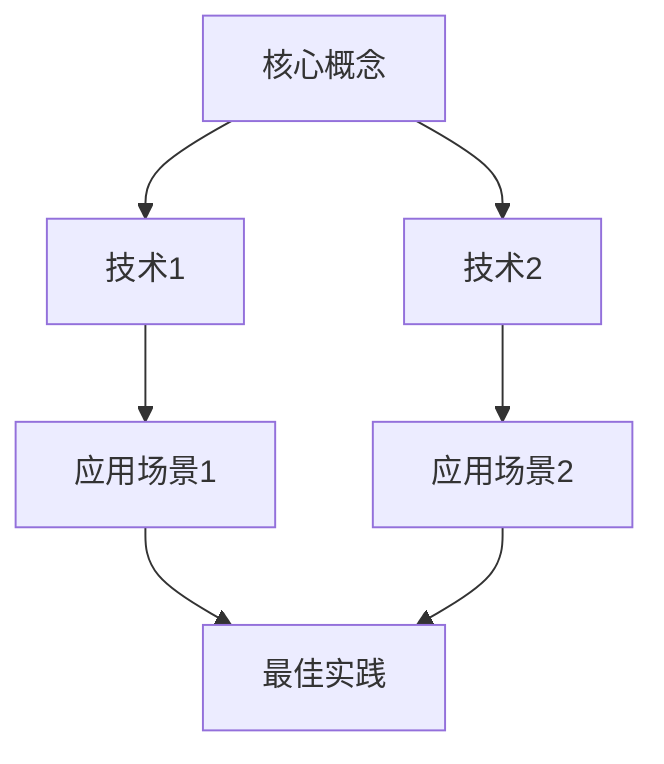
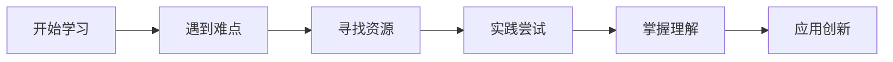

# [主题]学习总结

## 基本信息
- **学习时间**: [开始日期] - [结束日期]
- **学习时长**: [总小时数] 小时
- **学习形式**: [自学/课程/培训]
- **掌握程度**: [入门/熟练/精通]

## 学习目标
### 主要目标
1. 目标1: [具体描述]
2. 目标2: [具体描述]
3. 目标3: [具体描述]

### 次要目标
- 扩展知识: [相关领域]
- 技能提升: [具体技能]
- 项目应用: [实际用途]

## 学习内容

### 核心概念
#### 概念1: [名称]
**定义**: [清晰定义]
**特点**: 
- 特点1
- 特点2
- 特点3

**应用场景**:
- 场景1
- 场景2

#### 概念2: [名称]
**定义**: [清晰定义]
**原理**: [工作原理说明]
**优势**: 
- 优势1
- 优势2

### 关键技术
#### 技术1: [技术名称]
```python
# 代码示例
def example_function():
    """功能说明"""
    pass
```

**使用要点**:
1. 要点1
2. 要点2
3. 要点3

**注意事项**:
- 注意1
- 注意2

#### 技术2: [技术名称]
```javascript
// 代码示例
function exampleFunction() {
  // 功能说明
}
```

**最佳实践**:
- 实践1
- 实践2

### 知识体系


## 实践项目

### 项目1: [项目名称]
#### 项目描述
- **目标**: [项目目标]
- **范围**: [项目范围]
- **技术栈**: [使用技术]

#### 实现过程
**阶段1: 准备**
```bash
# 环境搭建
mkdir project
cd project
npm init -y
```

**阶段2: 开发**
```python
# 核心代码
class MainComponent:
    def __init__(self):
        self.data = []
    
    def process(self):
        # 处理逻辑
        pass
```

**阶段3: 测试**
```bash
# 运行测试
pytest tests/
```

#### 成果展示
**功能特性**:
- ✓ 特性1
- ✓ 特性2
- ⏳ 特性3 (进行中)

**性能指标**:
- 响应时间: < 100ms
- 成功率: 99.9%
- 并发数: 1000+

**代码统计**:
```text
语言        文件数        代码行数
Python       15           1200
JavaScript   8            800
Markdown     5            300
```

### 项目2: [项目名称]
(类似结构...)

## 学习收获

### 知识掌握
1. **理论知识**: [掌握程度]
   - 理解了 [概念] 的原理
   - 掌握了 [方法] 的应用

2. **实践技能**: [掌握程度]
   - 能够独立完成 [任务]
   - 熟练使用 [工具]

3. **问题解决**: [能力提升]
   - 学会了 [调试方法]
   - 掌握了 [优化技巧]

### 思维提升
- **系统性思维**: 能够从整体角度分析问题
- **批判性思维**: 学会质疑和验证假设
- **创造性思维**: 提出创新解决方案

### 经验积累
- 遇到了 [具体问题] 并成功解决
- 优化了 [某个流程] 提升效率
- 总结了 [经验教训] 避免重复错误

## 难点与突破

### 主要难点
1. **难点1**: [描述难点]
   - **原因**: 知识储备不足/工具不熟悉
   - **表现**: 无法理解某个概念
   - **解决**: 通过 [方法] 突破

2. **难点2**: [描述难点]
   - **原因**: 实践经验缺乏
   - **表现**: 实现效果不理想
   - **解决**: 参考 [资源] 改进

### 突破方法
- **方法1**: 拆解问题，分步解决
- **方法2**: 查阅文档，学习案例
- **方法3**: 实践验证，迭代优化

### 学习曲线


## 自我评估

### 技能掌握程度
| 技能类别 | 掌握程度 | 自信程度 | 需要加强 |
|---------|---------|---------|---------|
| 理论知识 | 80% | 高 | 深度理解 |
| 实践能力 | 70% | 中 | 复杂场景 |
| 工具使用 | 90% | 高 | 高级功能 |
| 问题解决 | 75% | 中 | 系统设计 |

### 学习效率评估
- **时间投入**: [实际 vs 计划]
- **目标完成**: [完成百分比]
- **知识留存**: [记忆效果]

### 改进方向
1. **短期改进** (1个月内)
   - [ ] 加强 [薄弱环节]
   - [ ] 完成 [未完成内容]

2. **中期计划** (3个月内)
   - [ ] 深入学习 [进阶主题]
   - [ ] 参与 [实际项目]

3. **长期规划** (1年内)
   - [ ] 掌握 [相关领域]
   - [ ] 产出 [有价值成果]

## 资源推荐

### 学习资料
#### 书籍
1. **《[书名]》** - [作者]
   - 适合人群: [读者类型]
   - 推荐理由: [优点]

2. **《[书名]》** - [作者]
   - 适合人群: [读者类型]
   - 推荐理由: [优点]

#### 在线课程
- [课程平台]: [课程名称] - [讲师]
- [课程平台]: [课程名称] - [讲师]

#### 文档资源
- [官方文档]: [链接]
- [技术博客]: [链接]
- [社区论坛]: [链接]

### 工具推荐
- **开发工具**: [工具名称] - [用途]
- **调试工具**: [工具名称] - [用途]
- **学习工具**: [工具名称] - [用途]

## 下一步计划

### 立即行动 (本周内)
1. [ ] 整理学习笔记
2. [ ] 完成实践项目
3. [ ] 分享学习心得

### 短期计划 (1个月内)
1. [ ] 深入学习 [具体主题]
2. [ ] 参与 [社区活动]
3. [ ] 开始 [新项目]

### 中长期规划 (3-6个月)
1. [ ] 掌握 [技能组合]
2. [ ] 完成 [认证考试]
3. [ ] 贡献 [开源项目]

## 总结反思

### 成功经验
1. **有效方法**: [具体方法] 效果显著
2. **良好习惯**: [习惯描述] 帮助很大
3. **资源利用**: [资源类型] 很有价值

### 改进空间
1. **时间管理**: 可以更高效安排学习时间
2. **深度学习**: 需要更多实践加深理解
3. **知识串联**: 加强不同知识点之间的联系

### 心得体会
- 学习是一个持续的过程，需要耐心和坚持
- 理论与实践结合才能真正掌握知识
- 分享和交流能够加速学习进程

## 附录

### 学习时间记录
| 日期 | 学习内容 | 时长 | 完成情况 |
|------|---------|------|---------|
| [日期] | [内容] | [时长] | [状态] |
| [日期] | [内容] | [时长] | [状态] |

### 代码片段收藏
```python
# 有用的代码片段1
def useful_function():
    pass
```

```javascript
// 有用的代码片段2
const usefulUtil = () => {
  // 实现
};
```

### 问题记录
| 问题 | 解决方法 | 参考链接 |
|------|---------|---------|
| [问题] | [方法] | [链接] |
| [问题] | [方法] | [链接] |

---

**最后更新**: [日期]  
**下次复习**: [计划日期]  
**学习状态**: [进行中/已完成]

**提示**: 定期回顾总结，巩固学习成果，持续改进学习方法。